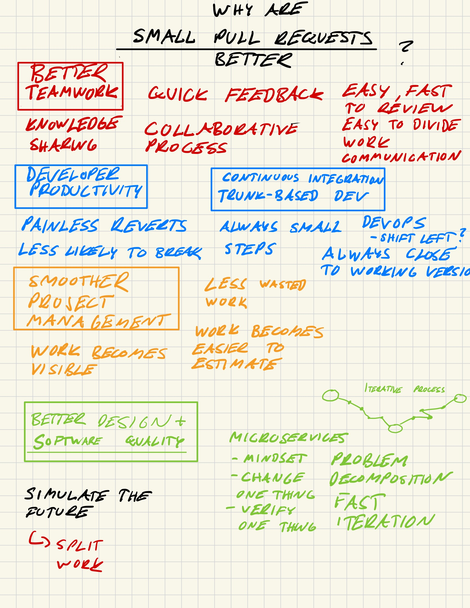
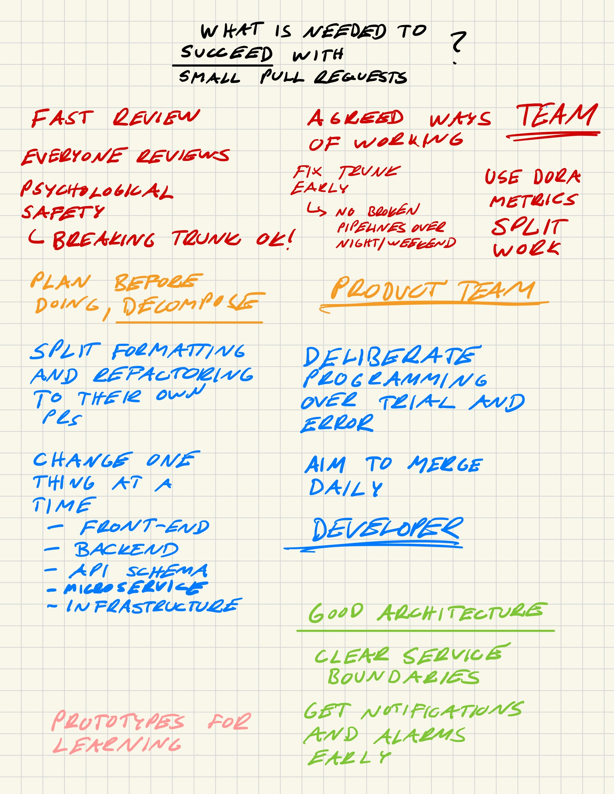
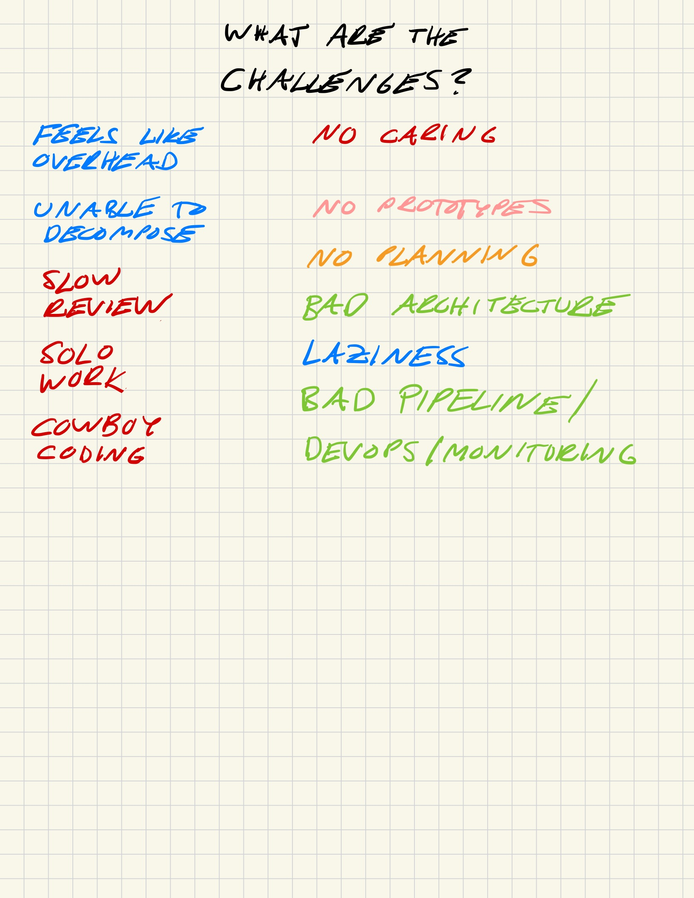

# The Power of Small Pull Requests

I have been working in professional software development for ten years. During these years, I have learned that the single most important development principle is to create small pull requests. This post explains why.

<!-- more -->

I recently came across a blog post named [_My programming beliefs as of July 2024_](https://evanhahn.com/programming-beliefs-as-of-july-2024/) by [Evan Hahn](https://evanhahn.com/). I very much liked the post and I can agree with most of the beliefs mentioned therein: focusing on testability, making invalid states unrepresentable and that simple opinions tend to be wrong, for example.

Reading the post made me want to write about what I believe to be the most important principles of software development. If I had to pick one belief above all else, it would be this: _most good things in software development stem from small pull requests_.

What are pull requests? [Pull requests](https://docs.github.com/en/pull-requests/collaborating-with-pull-requests/proposing-changes-to-your-work-with-pull-requests/about-pull-requests) are a mechanism in version control providers such as [GitHub](https://github.com/) to propose changes to a codebase and integrate those changes to together, as explained in this definition from GitHub:

> _A pull request is a proposal to merge a set of changes from one branch into another. In a pull request, collaborators can review and discuss the proposed set of changes before they integrate the changes into the main codebase. Pull requests display the differences, or diffs, between the content in the source branch and the content in the target branch._

This post is split to three parts: why small pull requests are so good, what is needed to succeed with them, and finally, what the major challenges are in adopting them.

## Why small pull requests?

Small pull requests are so beneficial in software development, because they improve the development process at various levels. They improve the developer productivity, teamwork, project management and the overall software quality.

### Better teamwork

Small pull requests (PRs) are created more often than large ones. Therefore, developers writing small pull requests get faster feedback from their colleagues. Showing work to others early and often is [one of the most important traits](https://abseil.io/resources/swe-book/html/ch02.html) of good teamwork.

Smaller pull requests are easier and faster to review, which saves developers' time and reduces the back-and-forth in code review. Sometimes I hear that large pull requests are easier to review, because they give reviewers the "full picture". I think that's rarely the case. To give the full picture, developers in the team must communicate on daily basis so that everyone knows what others are working on. Pull request authors can also help reviewers understand the full context by clearly explaining in the PR description how the work at hand is related to previous and upcoming work.

Creating small pull requests improves communication in the team. When small units of work are made visible via pull requests, everyone in the team can understand how the development work is progressing. In the case of absences such as sick leaves, it is also easier for other developers to step in and take work over.

When the creation of small pull requests becomes a habit in the team, it also becomes easier to divide work between developers. Developers become more skilled at "simulating future" in their heads and planning their work step-by-step. When work is planned and executed like this, it becomes easier for other developers to contribute to features with their own small, targeted pull requests.

I believe that most of the [lone developer problem](https://evanhahn.com/the-lone-developer-problem/) stems from bad communication or planning. If the development philosophy is "start coding and see what happens", it is very difficult to work together. Teams working in this way end up sharing development responsibilities at higher levels such as per component–for example, one developer might work on the backend while the other works on the frontend. In my experience, this is suboptimal and often leads to worse-quality software in the long run.

Small pull requests improve knowledge sharing in the team. Large, difficult-to-review pull requests are reviewed or even read only by 1-2 developers in the team. Therefore, many of the business-critical features end up being only known by this small set of developers. Small pull requests are more easily reviewed also by developers who are not yet as familiar with the full system. Reviewing pull requests is a great way to get started with sharing knowledge about complex systems.

### Better developer productivity

Modern software development practices such as [trunk-based development](https://www.atlassian.com/continuous-delivery/continuous-integration/trunk-based-development), [continuous integration](https://martinfowler.com/articles/continuousIntegration.html) and [DevOps](https://www.atlassian.com/devops) push developers to take smaller steps to get faster feedback about their changes. In trunk-based development, developers make small changes to a single shared main branch (via pull requests) instead of creating long-lived branches for new features or releases. Continuous integration asks developers to merge their work to the trunk on a daily basis, to integrate the team's work together as soon as possible. DevOps highlights the importance of getting early feedback about code changes, by "shifting left" in the developer workflow to catch bugs before they affect the end-users.

Small pull requests are perfectly aligned with all of these development practices. Small, fast pull requests allow the team to continuously integrate their work together, enabling automated pipelines to continously test the new versions as a whole. Automated testing and monitoring delivers early feedback to the developers, notifying them about bugs and inadvertent behaviour as soon as possible.

A common practice in software development teams is to link pull requests to development "tickets". Tickets are used in work management platforms such as [Jira](https://www.atlassian.com/software/jira) to keep track of tasks and to assign them to developers. I believe there are two traps in development teams about tickets.

The first trap is the belief that there should be a single pull request per ticket. Such one-to-one mapping may seem handy, because it allows project managers to track features directly to code changes. However, this practice also encourages creating large pull requests that may affect multiple code components at a single time.

Second trap is the common misconception, especially among more junior developers, that developers should finish tickets as early as possible to be seen as productive. The number of completed tickets is not a good measure of productivity, because it encourages sacrificing quality for speed.

When a developer tries to finish their tickets as soon as possible, they have tendency to either (1) assume that the first idea that comes to their mind is the best solution, creating lower-quality software, or (2) take shortcuts in the development, creating technical debt. Developers should rather be enrouraged to deeply understand the problem at hand and to find the best solution available. They should interact with their peers for advice and feedback. The team should also keep a very close eye on software quality, especially in the code review phase. Pull request authors should be asked to refactor their code when needed, possibly in separate refactoring pull requests that are not expected to affect the system behaviour.

A better proxy metric of productivity for individual developers is the number of pull requests they have created and the speed at which they were reviewed.

Software development teams should attempt to deliver high-quality software to users at a _sustainable_ pace. They should keep up with their roadmap development plan while keeping their customers happy and delivering new features and product at a predictable pace. If the team tries, instead, to deliver software as fast as possible, their productivity may soar in the beginning, but will slow down in the long run.

Small pull requests improve developer productivity by reducing the risk of breaking applications or pipelines, saving developers' time from debugging, fixing and reverting. Small changes are less likely to break than large changes. Small changes are easier to fix and revert than large changes, because when changes are made incrementally, the software is always close to a working version.

### Better project management

### Better software quality

- Small pull request -> easier to focus on smaller details instead of letting things slip through

## Handbook for practical development

Make backend-frontend changes step by step:

1. API code changes (possibly preced by OpenAPI changes)
1. Frontend code changes

If API changes require database changes, commit them step-by-step:

1. Database changes
1. API changes

Make backend infrastructure changes step-by-step:

1. Backend code changes (with feature flags)
1. Backend infrastructure changes with disabled feature flags
1. Enable feature flags

## Notes

<figure markdown>
  { width="200", loading=lazy }
</figure>

<figure markdown>
  { width="200", loading=lazy }
</figure>

<figure markdown>
  { width="200", loading=lazy }
</figure>
