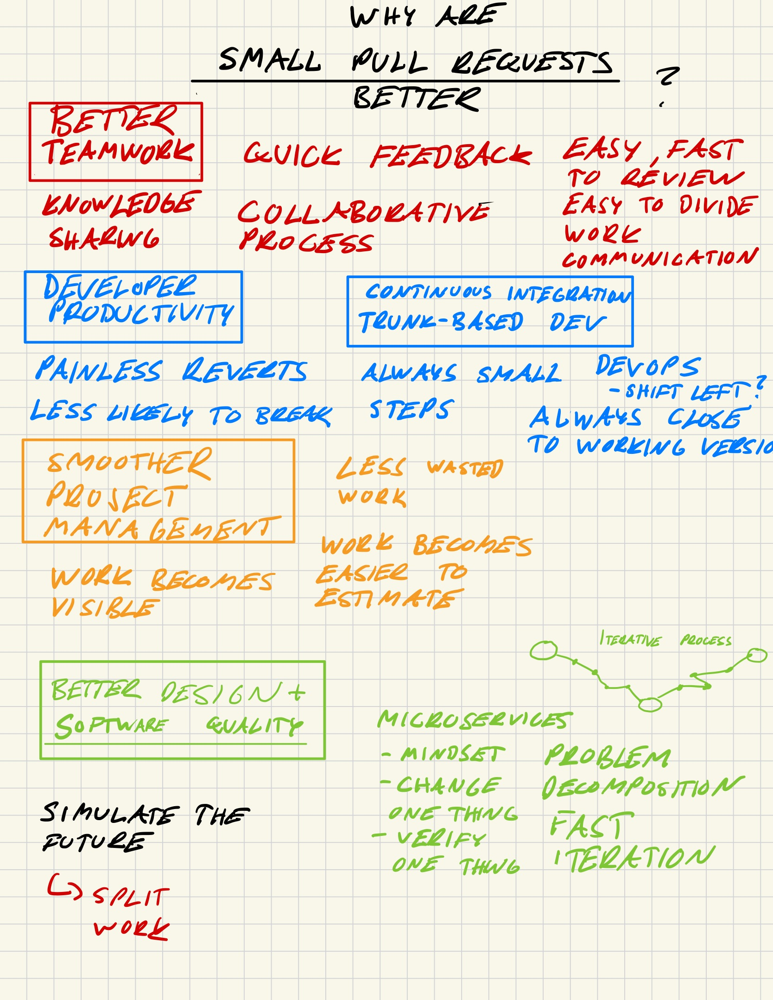
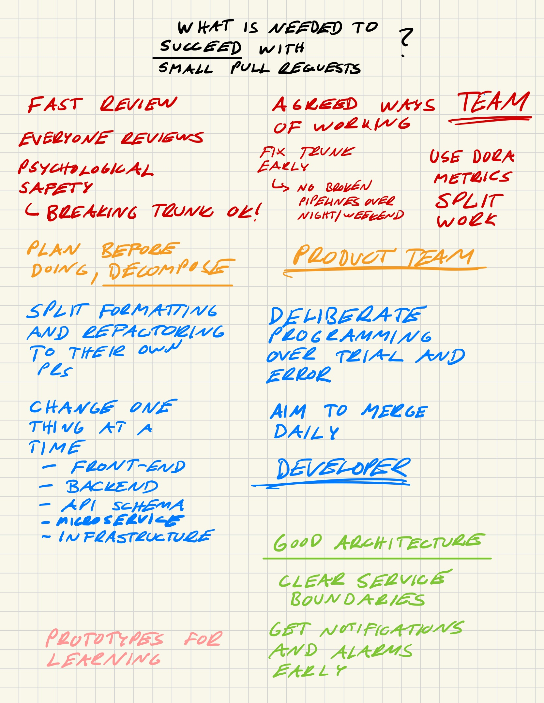

# How to succeed with small pull requests

<!-- more -->

## Handbook for practical development

Make backend-frontend changes step by step:

1. API code changes (possibly preced by OpenAPI changes)
1. Frontend code changes

If API changes require database changes, commit them step-by-step:

1. Database changes
1. API changes

Make backend infrastructure changes step-by-step:

1. Backend code changes (with feature flags)
1. Backend infrastructure changes with disabled feature flags
1. Enable feature flags

## Notes

<figure markdown>
  { width="200", loading=lazy }
</figure>

<figure markdown>
  { width="200", loading=lazy }
</figure>

<figure markdown>
  { width="200", loading=lazy }
</figure>
