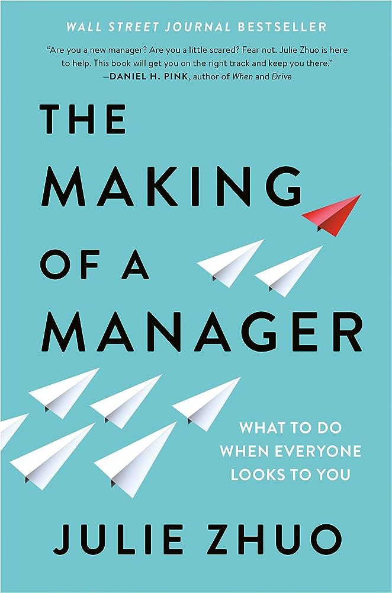

# Bookshelf

This page presents some books that I've enjoyed. Many of them have had a big impact on what I know and how I see the world.

#### The Making of a Manager

<figure markdown>
  { width="200", loading=lazy }
</figure>

_The Making of a Manager_ by Julie Zhuo is my favorite book on management and teamwork. The book starts from the basics and explains what management is about: getting better outcomes from a group of people working together. It then goes on to describe the first three months as a manager, how to lead a small team, how to run amazing meetings, etc. One of my favorite chapters explains how to manage yourself to become a better person, employee and colleague.

The advice in this book is useful for everyone who wants to improve the relationship with their manager and to learn to work better as a member of a team. I highly recommend the book for everyone.
