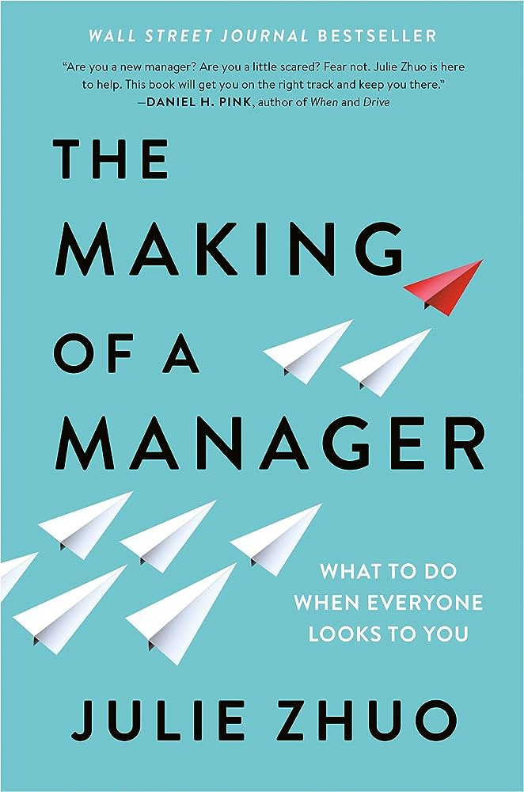

# Favorite tech books

This page include some tech books that I've enjoyed. They have had a big impact on my career.

#### The Making of a Manager

<figure markdown>
  { width="200", loading=lazy }
</figure>

_The Making of a Manager_ by Julie Zhuo is my favorite book on management and teamwork. The book starts from the basics and explains what management is about: getting better outcomes from a group of people working together. It then goes on to describe the first three months as a manager, how to lead a small team, how to run amazing meetings, etc. One of my favorite chapters explains how to manage yourself to become a better person, employee and colleague.

The advice in this book is useful for everyone who wants to improve the relationship with their manager and to learn to work better as a member of a team. I highly recommend the book for everyone.

#### The Pragmatic Programmer, 20th Anniversary Edition

<figure markdown>
  { width="200", loading=lazy }
</figure>

_The Pragmatic Programmer_ is hands-down the best book on the life as a professional software developer. The chapters on taking ownership and avoiding lame excuses have had a profound influence on how I think about my work. The essence of software design is condensed to the simple phrase "Good design is easy to change", which is both easy to remember and widely applicable. The book includes advanced concepts such as functional programming in very hands-on and pragmatic manner.

The full list of tips from the book is available online at [pragprog.com](https://pragprog.com/tips/).

#### Software Engineering at Google

<figure markdown>
  { width="200", loading=lazy }
</figure>

_Software Engineering at Google_ is a fantastic reference on professional software engineering. The book provides very practical advice how to work in a team, how to lead a team, how to review code, how to test software etc.

The book is available as free online version in [abseil.io](https://abseil.io/resources/swe-book).

#### Ideal Team Player

<figure markdown>
  { width="200", loading=lazy }
</figure>

_Ideal Team Player_ by Patrick Lencioni is a story about how to work efficiently as a team. It shows how a team consisting of hungry, humble and smart individuals can overcome challenges and be more than the sum of its parts. Being a good team player is not only about being efficient and doing your work, but lifting the whole team up by being a good person.
