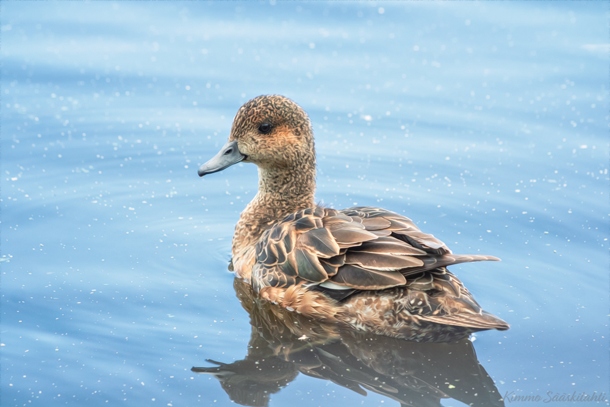

# My photos

I photograph beings in nature with a Canon EOS 750D camera. For wildlife photography, I mostly use Canon EF 70-300mm f/4-5.6 IS II USM lens.

I postprocess photos using Adobe Lightroom Classic and Adobe Photoshop.

<figure markdown>
  { loading=lazy }
  <figcaption>Eurasian Wigeon photographed in Pornaistenniemi hide in July 2023</figcaption>
</figure>

Wigeons are among the most beautiful waterfowl species. Their small, round head gives them a very elegant look. Especially the females and the young have beautiful feather ornaments in their back.

<figure markdown>
  { loading=lazy }
  <figcaption>Tawny Owl photographed in March 2018.</figcaption>
</figure>

<figure markdown>
  { loading=lazy }
  <figcaption>Some insect photographed in Hauho in May 2018.</figcaption>
</figure>

<figure markdown>
  { loading=lazy }
  <figcaption></figcaption>
</figure>

<figure markdown>
  { loading=lazy }
  <figcaption></figcaption>
</figure>

<figure markdown>
  { loading=lazy }
  <figcaption></figcaption>
</figure>

<figure markdown>
  { loading=lazy }
  <figcaption></figcaption>
</figure>

<figure markdown>
  { loading=lazy }
  <figcaption></figcaption>
</figure>

<figure markdown>
  { loading=lazy }
  <figcaption></figcaption>
</figure>

<figure markdown>
  { loading=lazy }
  <figcaption></figcaption>
</figure>

<figure markdown>
  { loading=lazy }
  <figcaption></figcaption>
</figure>

<figure markdown>
  { loading=lazy }
  <figcaption></figcaption>
</figure>

<figure markdown>
  { loading=lazy }
  <figcaption></figcaption>
</figure>

<figure markdown>
  { loading=lazy }
  <figcaption></figcaption>
</figure>

<figure markdown>
  { loading=lazy }
  <figcaption></figcaption>
</figure>

<figure markdown>
  { loading=lazy }
  <figcaption></figcaption>
</figure>

<figure markdown>
  { loading=lazy }
  <figcaption></figcaption>
</figure>

<figure markdown>
  { loading=lazy }
  <figcaption></figcaption>
</figure>

<figure markdown>
  { loading=lazy }
  <figcaption></figcaption>
</figure>

<figure markdown>
  { loading=lazy }
  <figcaption></figcaption>
</figure>

<figure markdown>
  { loading=lazy }
  <figcaption></figcaption>
</figure>

<figure markdown>
  { loading=lazy }
  <figcaption></figcaption>
</figure>

<figure markdown>
  { loading=lazy }
  <figcaption></figcaption>
</figure>

<figure markdown>
  { loading=lazy }
  <figcaption></figcaption>
</figure>

<figure markdown>
  { loading=lazy }
  <figcaption></figcaption>
</figure>

<figure markdown>
  { loading=lazy }
  <figcaption></figcaption>
</figure>

<figure markdown>
  { loading=lazy }
  <figcaption></figcaption>
</figure>

<figure markdown>
  { loading=lazy }
  <figcaption></figcaption>
</figure>

<figure markdown>
  { loading=lazy }
  <figcaption></figcaption>
</figure>

<figure markdown>
  { loading=lazy }
  <figcaption></figcaption>
</figure>

<figure markdown>
  { loading=lazy }
  <figcaption></figcaption>
</figure>

<figure markdown>
  { loading=lazy }
  <figcaption></figcaption>
</figure>

<figure markdown>
  { loading=lazy }
  <figcaption></figcaption>
</figure>

<figure markdown>
  { loading=lazy }
  <figcaption></figcaption>
</figure>

<figure markdown>
  { loading=lazy }
  <figcaption></figcaption>
</figure>

<figure markdown>
  { loading=lazy }
  <figcaption></figcaption>
</figure>

<figure markdown>
  { loading=lazy }
  <figcaption></figcaption>
</figure>

<figure markdown>
  { loading=lazy }
  <figcaption></figcaption>
</figure>

<figure markdown>
  { loading=lazy }
  <figcaption></figcaption>
</figure>

<figure markdown>
  { loading=lazy }
  <figcaption>European Hare photographed through spotting scope in my backyard in August 2023</figcaption>
</figure>

One of the best things about living where I live in East Helsinki is that there is a lot of wildlife. There are woodpeckers, hawks, geese, tits, foxes, stoats... But perhaps most importantly, there are two kinds of bunnies: European hares and European rabbits. Seeing bunnies brings a lot of joy in my everyday life.
